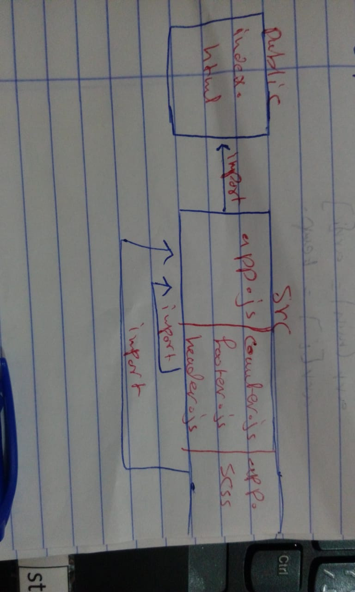

# LAB - Class 27

##  React Testing and Deployment

### Author: Saja Swalgah

### Links and Resources

- [submission PR](https://github.com/Saja-401-advanced-javascript/class-27/pull/1)
- [Github test](https://github.com/Saja-401-advanced-javascript/class-27/actions?query=workflow%3A%22Run+Javascript+Tests%22)
- [Github deployment](https://github.com/Saja-401-advanced-javascript/class-27/actions/runs/44579894)

#### How to initialize/run your application (where applicable)

-  `npm run start`
- `npm run test`

#### UML

.